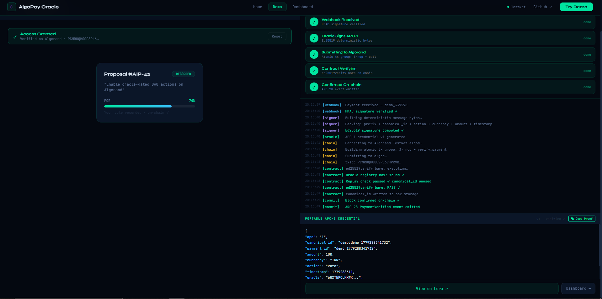
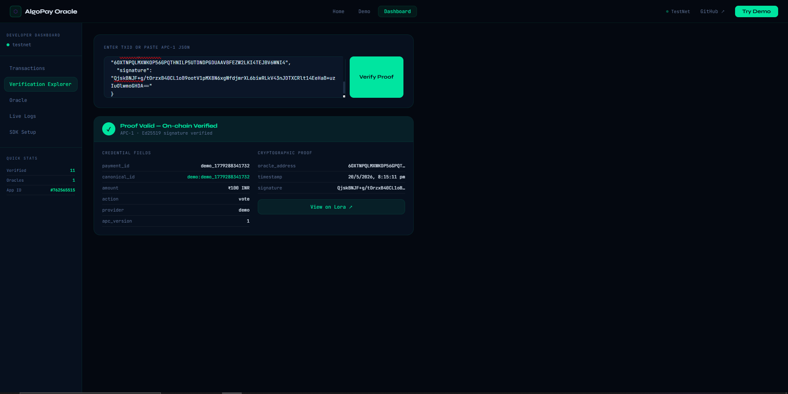
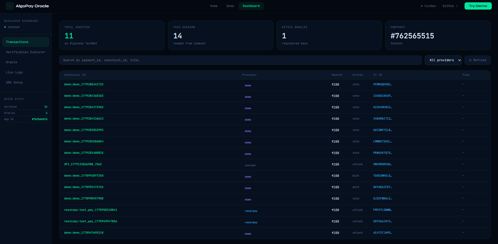
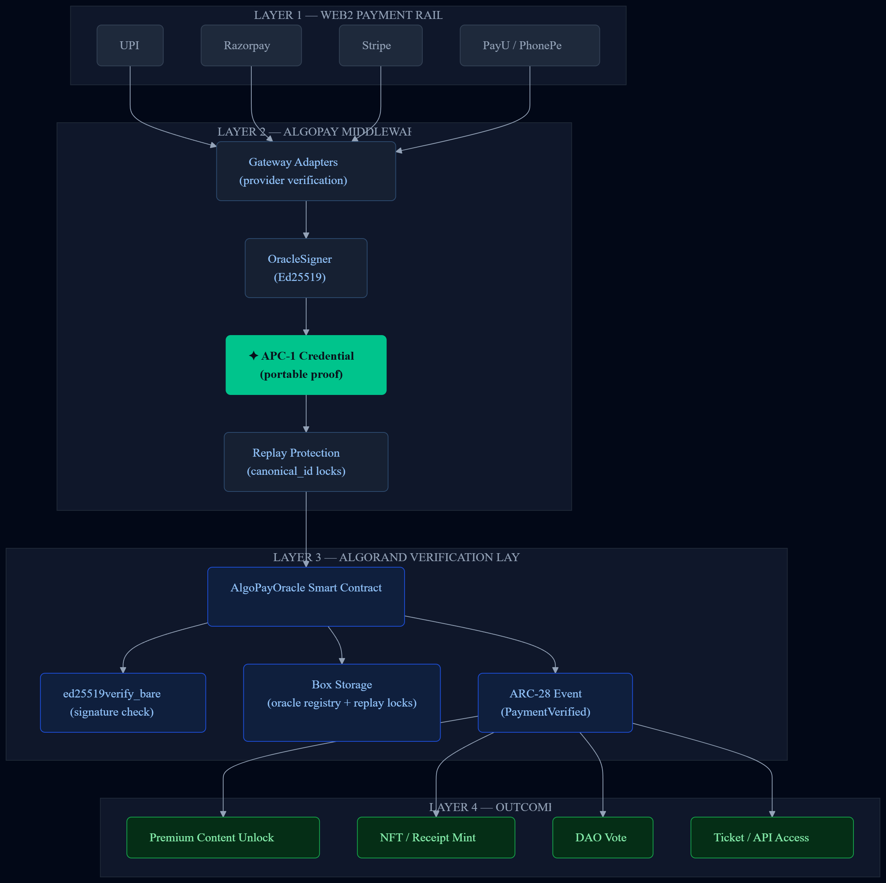

# AlgoPay Oracle v1.1

> Convert real-world payments into cryptographically verifiable on-chain credentials.

**The contract never trusts backend databases. It only evaluates cryptographic proofs.**

[Live Demo Sandbox](https://algopay-oracle.vercel.app) · [TestNet Dashboard](https://algopay-oracle.vercel.app/#/dashboard) · [Walkthrough Video](https://youtu.be/aeUGX7-iV6E) · [npm Package](https://www.npmjs.com/package/@algopayoracle/oracle-sdk)

---

## Interface Preview

### On-Chain Infrastructure Logs



> Watch live cryptographic logs, state changes, and verification progress.

### Verification Explorer



> Paste APC-1 JSON proofs to verify signatures off-chain or lookup indexer transactions.

### Real-Time Developer Dashboard



> Manage registered oracle keys, trace global statistics, and access code snippets.

---

## The Thesis

AlgoPay Oracle does not replace existing payment rails like UPI, Razorpay, or Stripe. Instead, AlgoPay sits on top of these networks and transforms transaction events into portable, standardized cryptographic credentials that smart contracts can verify and act upon.

This allows developers to add Web3 programmability, digital ownership, automated execution, and composable on-chain logic to traditional payment flows without changing the user experience.

**Invisible Web3 UX:** The end user never needs to buy cryptocurrency, pay gas, understand wallets, or bridge assets.

**Invisible Blockchain Integration:** Users continue paying through familiar Web2 payment checkouts like UPI or credit cards, while Web3 operates invisibly underneath.

*The frontend remains Web2. The backend becomes programmable Web3 infrastructure.*

In every case: the user experience is Web2. The execution guarantees are Web3.

---

## The Problem

Smart contracts are sandboxed and cannot natively verify real-world Web2 payment infrastructures. Today, applications rely on traditional backend verification checks:

```
Payment Gateway ──> Centralized Backend ──> Database Check ──> On-chain Unlock
```

This model introduces hidden trust assumptions, unverifiable backend state, and poor composability across applications.

---

## Why AlgoPay?

Building secure fiat-to-smart-contract infrastructure normally requires weeks of engineering:

- Webhook HMAC signature validation across multiple gateway providers.
- Server-authoritative state checks to prevent clients from spoofing payment amounts.
- Deterministic payload byte-level encoding to match contract execution.
- Cryptographic Ed25519 signing and keys management.
- Algorand Virtual Machine (AVM) opcode budget pooling and optimization.
- Custom smart contract verification and replay lock logic.

**AlgoPay compresses this fragile payment verification infrastructure into a reusable SDK and a programmable verification layer.**

---

## The Solution

AlgoPay replaces database-level trust with on-chain cryptographic verification:

```
Payment Gateway Webhook ──> Oracle Ed25519 Attestation ──> On-Chain Verification ──> Trustless Action
```

**The contract never trusts backend databases. It only evaluates cryptographic proofs.**

Smart contracts treating real-world payments as programmable cryptographic events allows developers to construct trustless gateways that bridge traditional fiat checkouts with verifiable Web3 environments.

---

## APC-1 — The Payment Credential Standard

> **This is the core of AlgoPay.** Every other part of the system exists to produce and verify this object.

When a payment is verified, AlgoPay produces an **APC-1 credential** — a self-contained, Ed25519-signed proof object that fully describes a payment event. It is provider-agnostic, portable, and independently verifiable by anyone who knows the oracle's public key — no backend, no database, no trust required.

```json
{
  "apc": "1",
  "payment_id": "pay_N1X8y3m9Z2vA",
  "canonical_id": "razorpay:pay_N1X8y3m9Z2vA",
  "amount": 100,
  "currency": "INR",
  "action": "unlock",
  "timestamp": 1714500000,
  "oracle_address": "APORC2O4P56GZKUXU7G6M2U7J3Z...",
  "signature": "dGhpcyBpcyBhbiBleGFtcGxlIHNpZ25hdHVyZSBmb3IgYWxnb3BheSBvcmFjbGUgdjEuMSBlZDI1NTE5...",
  "chain": "algorand",
  "network": "testnet",
  "app_id": 482910482,
  "provider": "razorpay"
}
```

**What makes APC-1 the moat:**

- **`canonical_id`** (`provider:payment_id`) is the namespaced key stored on-chain. It prevents cross-provider replay — a `razorpay:pay_ABC` proof cannot be reused as a `stripe:pay_ABC` proof even if the raw IDs are identical.
- **`signature`** is an Ed25519 signature over a deterministic byte buffer. The Algorand contract runs `ed25519verify_bare` directly — no off-chain trust, no intermediary.
- **`action`** is the intended on-chain trigger. The same payment infrastructure supports `unlock`, `mint`, `vote`, or any arbitrary string — without changing a single line of contract code.
- The credential is **time-bound** (5-minute freshness window) and **app-bound** (`app_id` is included in the signed message), so a valid proof from one deployment cannot be replayed against another.

Any third party who knows the oracle's public key can verify an APC-1 credential offline in under a millisecond. No API call. No indexer. No AlgoPay infrastructure.

**AlgoPay standardizes how real-world payment events become verifiable smart contract inputs.**

---

## What This Enables

**UPI-Native Gating:** A ₹100 UPI payment instantly unlocks a premium research report, SaaS access, or paid API - verified cryptographically on-chain, not by a database check.

**On-Chain Purchase Receipts:** A traditional Razorpay checkout automatically mints a standard ARC-69 NFT receipt directly into a user's wallet as immutable proof of purchase.

**Fiat-Backed DAO Voting:** Off-chain stakeholders can cast verifiable, frictionless votes in DAO governance proposals backed by fiat proof of checkout.

**Web2 Checkout to Web3 Delivery:** Trigger complex on-chain state changes, token distributions, or smart-contract-controlled escrow splits seamlessly from traditional e-commerce checkouts.

---

## Architecture Flow



---

## Quickstart

### 30-Second Path — See a live APC-1 proof on TestNet

No integration needed. This generates a real oracle identity, signs an APC-1 credential, verifies it off-chain, anchors it on Algorand TestNet, and returns a live explorer link.

**Linux / macOS**
```bash
npm install @algopayoracle/oracle-sdk
export ORACLE_MNEMONIC="your 25 words"
npx algopay quickstart
```

**Windows (PowerShell)**
```powershell
npm install @algopayoracle/oracle-sdk
$env:ORACLE_MNEMONIC="your 25 words"
npx algopay quickstart
```

What it does, in order:
1. Derives your oracle address and Ed25519 public key from the mnemonic
2. Signs a test payment as an APC-1 credential
3. Verifies the proof off-chain (no network required)
4. Anchors the proof on Algorand TestNet
5. Returns the confirmed transaction ID and a live Lora explorer link

---

### Full Integration — Connect any payment gateway

Bridge traditional payments to your smart contract in under 5 minutes.

```bash
npm install @algopayoracle/oracle-sdk
```

**1. Initialize the client**

```js
const { AlgoPayClient } = require("@algopayoracle/oracle-sdk");

const client = new AlgoPayClient({
  mnemonic: process.env.ORACLE_MNEMONIC,
  network:  "testnet",
  appId:    Number(process.env.ALGO_APP_ID),
});
```

**2. Sign and commit a payment**

Call this from any gateway webhook — Razorpay, Stripe, UPI, or custom.

```js
const result = await client.verifyAndCommit({
  payment_id: "pay_N1X8y3m9Z2vA",
  amount:     100,            // ₹100 base unit
  currency:   "INR",
  action:     "unlock",
  provider:   "razorpay"      // Enables namespaced replay protection
});

console.log(result.txId);        // Confirmed Algorand Transaction ID
console.log(result.apc1);        // Standardized APC-1 payment credential
```

**3. Enforce server-authoritative amounts**

Never trust `amount` from the client. The `RazorpayAdapter` orderStore pattern reads the amount from a server-side record — not the request body.

```js
// Sourced from src/razorpay.js
async parseClientPayment({ razorpay_order_id, razorpay_payment_id, razorpay_signature, action }) {
  const expected = crypto.createHmac("sha256", this.keySecret)
    .update(`${razorpay_order_id}|${razorpay_payment_id}`).digest();
  const received = Buffer.from(razorpay_signature, "hex");
  if (!crypto.timingSafeEqual(expected, received)) throw new ProviderAuthError("razorpay", "Signature mismatch");

  // Amount comes from the server-side order record, never from the request
  const record = await this.orderStore.consume(razorpay_order_id);
  if (!record) throw new ProviderAuthError("razorpay", "Order expired or missing");

  return { payment_id: razorpay_payment_id, amount: record.amount, currency: record.currency, action, provider: "razorpay" };
}
```

---

## Payment Adapters

Adapters are the only gateway-specific code in the entire system.

All provider-specific verification logic is isolated inside adapter modules. The oracle, APC-1 credential format, and smart contract remain completely provider-agnostic.

Supported adapters include:

- **Razorpay** (`RazorpayAdapter` - webhook validation & secure client-side checkouts)
- **Stripe** (`StripeAdapter` - payment intent success handlers)
- **PayU** (`PayUAdapter` - SHA-512 hash chain verification)
- **PhonePe** (`PhonePeAdapter` - UPI-native verify headers)
- **Generic Adapter** (custom HMAC / checksum verification for any gateway)

---

## Security & Replay Protection

**Namespaced Replay Locks:** The smart contract prevents duplicate verification by keeping an on-chain ledger of the `canonical_id` (`provider:payment_id`) inside box storage. This eliminates cross-provider replay attacks.

**Strict Freshness Windows:** Proofs are time-bound. The smart contract validates that proofs are processed on-chain within 5 minutes of being signed by the oracle, protecting against delayed-relay exploits.

**Hot-Swappable Key Rotation:** The contract creator can register multiple oracle keys and rotate them without dApp downtime using creator-only admin methods.

**Server-Authoritative Enforcement:** Never trust payment amount fields provided directly by client checkout responses. The SDK's built-in adapters enforce verification by fetching immutable values cached securely on the server (via `OrderStore`).

**Trust Anchor Protection:** The oracle's 25-word mnemonic represents your network's primary trust anchor. Keep it isolated, never log it, and rotate oracle keys immediately via contract actions if compromised.

### Server Infrastructure

The reference infrastructure separates:

- Public payment verification endpoints (exposed to checkout webhooks and public lookups).
- Privileged oracle management endpoints (restricted to secure local proxy networks).

Admin operations such as oracle rotation are isolated behind separate authenticated services.

---

## Advanced Implementation Details

### Opcode Budget Pooling

`ed25519verify_bare` costs 1,900 AVM opcodes — more than a single transaction's base budget. The SDK sends 3 `nop()` calls in the same Atomic Transaction Composer group, pooling 4 × 700 = 2,800 base budget before the signature check runs.

### Deterministic Byte-Level Encoding

Signed payloads are packed into a deterministic Big-Endian byte buffer. This layout must match exactly between `OracleSigner.js` and `AlgoPayOracle.py` — any drift breaks verification.

```
MX + AlgoPay:v1: + canonical_id + action + currency + amount(8B BE) + timestamp(8B BE) + app_id(8B BE)
```

(`MX` is prepended by `algosdk.signBytes` on the SDK side, and manually by the contract before `ed25519verify_bare`.)

### Dual-Purpose Box Storage

The contract uses two distinct box topologies:

- **Oracle Registry:** keyed by raw 32-byte Ed25519 pubkey → `b"1"` (existence flag)
- **Replay Locks:** keyed by `canonical_id` bytes → `b"1"` (written on first successful verification, rejecting all duplicates)

---

## Local Setup & Deployment

### Backend

Install dependencies:

```bash
cd backend
npm install
```

Configure Environment (`.env`):

```env
ORACLE_MNEMONIC="word1 word2 word3 word4 word5 word6 word7 word8 word9 word10 word11 word12 word13 word14 word15 word16 word17 word18 word19 word20 word21 word22 word23 word24 word25"
ALGO_NETWORK="testnet"
ALGO_APP_ID=482910482
NODE_ENV="development"
PORT=5000
ADMIN_PORT=5001
ADMIN_API_KEY="7b5c91e4a3f...your_secure_generated_api_hex_key_string..."
ALLOWED_ORIGINS="http://localhost:5173,http://localhost:3000"
DEMO_MODE=true
```

Start the API Server:

```bash
npm run example
```

### Frontend

Install dependencies:

```bash
cd frontend
npm install
```

Configure Environment (`.env`):

```env
VITE_API_URL=http://localhost:5000
```

Run in development mode:

```bash
npm run dev
```

---

## Smart Contract Operations

**`verify_payment()`**
- Verifies the cryptographic signature off-chain block parameters.
- Validates transaction timestamp freshness (5-minute expiration window).
- Enforces the dynamic pricing constraint on-chain (guaranteeing minimum payment of ₹100).
- Writes the namespaced key `canonical_id` to Box storage to protect against replay attempts.
- Emits an ARC-28 standard on-chain event containing the validated details for indexing.

**`nop()`**
- Used for opcode budget pooling (adds 700 budget units per call).

**`add_oracle()` / `remove_oracle()`**
- Creator-only methods allowing dynamic key rotation and registration of new signing accounts.

---

## Conclusion & Roadmap

AlgoPay Oracle v1.1 transforms Web2 payment gateway notifications into cryptographically secured, reusable, and composable on-chain credentials. It bridges traditional financial systems with blockchain applications in a secure, efficient, and cost-effective manner.

Future iterations of the protocol will focus on:

- **Multi-Oracle Signatures (TSS):** Distributing trust across a consensus of threshold signature nodes to remove the single-oracle trust anchor.
- **ZK-Verified Payment Credentials:** Utilizing zero-knowledge proofs to attest that a payment succeeded with a valid amount and currency, without publishing private gateway references or user identifiers on-chain.

---

## License

This project is licensed under the MIT License. See [LICENSE](LICENSE) for details.